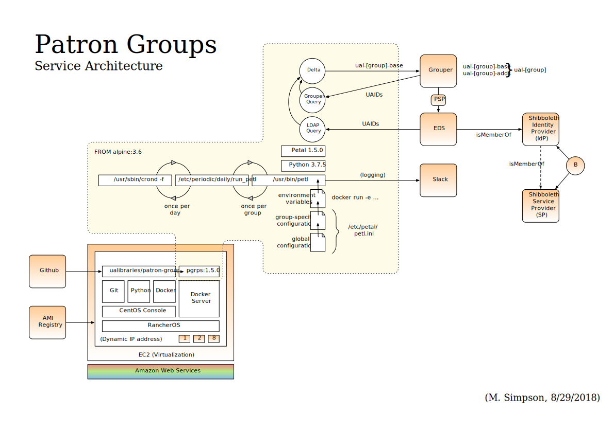

# UAL Patron Groups

## Overview

This project comes in two pieces:

*   The first piece is a small, quick [Python][python] hack that
    synchronizes [LDAP][ldap] queries against UA's Enterprise
    Directory Service ("EDS") into [Grouper][grouper] groups living in
    UA's central Grouper service.  In the original use case, those
    group memberships then show up as "isMemberOf" attributes in the
    information returned from a successful [Shibboleth][shibboleth]
    authentication; vendors running Shib-aware services can then use
    the "isMemberOf" information to make authorization and access
    control decisions.

*   The second piece is a [Docker][docker] container that provides the
    runtime environment for the first piece: a minimal [Alpine
    Linux][alpine] distribution, with just enough added package
    support to run the Python bits of the first piece, plus a
    [Crond][crond] daemon configured to run the patron group load jobs
    once a day at or around midnight.  Once built, the resulting
    Docker image should be deployable into any standard Docker
    environment; no persistent state is generated so a simple "remove
    when done" instantiation will work fine.

Note that the general principle behind this project -- exposing the
complexity of "who gets access to what" as simple authorization
attributes based on group membership -- should hopefully be broadly
applicable to other use cases in the future.

## Setup

### Python
    
Install a Python 3 environment, using your preferred method and
following the instructions on the Python website. If you want to avoid
polluting your system-level Python environment, install a local
environment using something like [PyEnv][pyenv] and
[PyEnv-Virtualenv][pyenv-virtualenv], e.g. on macOS:

    % brew update
    % brew install pyenv
    % brew install pyenv-virtualenv
    
        [ added shim lines to shell startup files as instructed by installation output ]
        
    % pyenv install 3.7.4
    % pyenv virtualenv 3.7.4 ual-patron-groups
    % pyenv global ual-patron-groups
    
        % which python
        /Users/mgsimpson/.pyenv/shims/python

        % pyenv which python
        /Users/mgsimpson/.pyenv/versions/ual-patron-groups/bin/python

        % python --version
        Python 3.7.4

### Docker

Install a recent-version Docker environment, following installation
instructions for your OS on the Docker website, e.g. on macOS:

    [ followed download and installation instructions for Docker Desktop for Mac ]
    [ started Docker app ]
    
        % which docker
        /usr/local/bin/docker
        
        % docker --version
        Docker version 19.03.4, build 9013bf5

### Source

Clone the repository into a project directory using your preferred
method, e.g.

    % cd Desktop/Projects
    % git clone git@github.com:ualibraries/patron-groups.git ual-patron-groups
    % cd ual-patron-groups

You should now be ready to build the project.

## Building

### Python Module

Change to the Python source directory, install the module's
prerequisites, and then build a source distribution of the module:

    % cd src/main/python
    % pip install --trusted-host pypi.python.org -r requirements.txt
    % python setup.py sdist
    
        % ls dist
        petal-1.5.1.tar.gz
        
    % cd ../../..
    
### Docker Image

Change to the Docker source directory, copy the distribution file over
from the Python side, and build the Docker container image:

    % cd src/main/docker
    % cp ../python/dist/petal-1.5.1.tar.gz .
    % docker build -t pgrps:1.5.1 .
    
        % docker images
        REPOSITORY          TAG                 IMAGE ID            CREATED             SIZE
        pgrps               1.5.1               16cfafa9d0f1        12 seconds ago      80.1MB
        
    % cd ../../..
    
## Running

### Setup

Set the following environment variables to appropriate values:

    LDAP_PASSWD
    GROUPER_PASSWD
    SLACK_WEBHOOK

The LDAP and Grouper passwords are used for building out the patron
groups themselves; the Slack webhook controls where the logging output
will go.
    
### Testing

If you want to fire up the container and poke around, or run things by
hand, instantiate using an interactive shell:

    % docker run -e "LDAP_PASSWD=${LDAP_PASSWD}" \
                 -e "GROUPER_PASSWD=${GROUPER_PASSWD}" \
                 -e "SLACK_WEBHOOK=${SLACK_WEBHOOK}" \
                 --rm -it pgrps:1.5.1 /bin/bash

        # which petl
        /usr/bin/petl
        
        # /etc/periodic/daily/run_petl
        [ ... ]
        
        # exit

The log output from the "run_petl" invocation should wind up in the
Slack channel associated with the "SLACK_WEBHOOK" environment variable
set above.

### Production

If you want to instantiate the container, and let the installed cron
daemon run the patron group load automatically once a day, instantiate
in the background:

    % docker run -e "LDAP_PASSWD=${LDAP_PASSWD}" \
                 -e "GROUPER_PASSWD=${GROUPER_PASSWD}" \
                 -e "SLACK_WEBHOOK=${SLACK_WEBHOOK}" \
                 --rm -d pgrps:1.5.1

The log output from the "run_petl" invocation should once again wind
up in the Slack channel associated with the "SLACK_WEBHOOK"
environment variable set above.

## Maintainers

Mike Simpson, mgsimpson@email.arizona.edu

[python]: https://www.python.org/
[ldap]: https://en.wikipedia.org/wiki/Lightweight_Directory_Access_Protocol
[grouper]: https://www.internet2.edu/products-services/trust-identity/grouper/
[shibboleth]: https://shibboleth.net/
[docker]: https://www.docker.com/
[alpine]: https://alpinelinux.org/
[crond]: https://en.wikipedia.org/wiki/Cron
[gradle]: https://gradle.org/
[homebrew]: https://brew.sh/
[pyenv]: https://github.com/pyenv/pyenv
[pyenv-virtualenv]: https://github.com/pyenv/pyenv-virtualenv
